``` r
library(knitr)
library(OCMSutility)
library(ggplot2)
library(dplyr)
#> 
#> Attaching package: 'dplyr'
#> The following objects are masked from 'package:stats':
#> 
#>     filter, lag
#> The following objects are masked from 'package:base':
#> 
#>     intersect, setdiff, setequal, union
library(tibble)
```

# Overview

This package was created by members of the Oxford Centre for Microbiome
Studies (OCMS). It is a collection of functions that we have found
useful and hope that they are useful to others. The functions span data
manipulation, statistical analysis and data visualisation, predominantly
for microbiome data. Functions in this package and use cases are
documented below.

# Package Data

This package comes with an example 16S dataset, which is the DSS study
[found here](https://pmc.ncbi.nlm.nih.gov/articles/PMC6120875/).
Different aspects of this example data can be accessed.

<details>
<summary>
asv example
</summary>

## asv\_example

A dataframe with samples in columns, features in rows. First column is
`sequence`.

``` r
data(asv_example)

# 49 ASVs and 296 samples
dim(asv_example)
#> [1]  49 296
```

</details>
<details>
<summary>
tax example
</summary>

## tax\_example

A dataframe of taxonomic classification of ASVs in `asv_example`

``` r
data(tax_example)
#> Warning in data(tax_example): data set 'tax_example' not found

# 49 ASVs, with taxonomic levels in columns 
dim(tax_example)
#> [1] 49  7
colnames(tax_example)
#> [1] "sequence" "Phylum"   "Class"    "Order"    "Family"   "Genus"    "Species"
```

</details>
<details>
<summary>
dss example
</summary>

## dss\_example

A list of dataframes. Contains ASV count, ASV taxonomy, and metadata for
the DSS experiment. Dataframes are structured to be compatible with
`OCMSlooksy`

``` r
data(dss_example)

summary(dss_example)
#>                       Length Class      Mode
#> merged_abundance_id   26     data.frame list
#> merged_filter_summary  3     data.frame list
#> merged_qc_summary      3     data.frame list
#> merged_taxonomy       10     data.frame list
#> parameter_table        3     data.frame list
#> metadata              11     data.frame list
```

</details>

# 16S Data Manipulation

<details>
<summary>
filter feature
</summary>

## filter\_feature

Filters count table based on sequence abundance and prevalence. This
function returns several outputs that detail which features were
filtered out to help with quality control.

There are three methods by which sequences can be filtered. For all
three methods, the cut-off threshold is taken into consideration with
the prevalence of sequences across the samples\*. 1) ‘abs\_count’ refers
to read count.Sets the filter threshold at a specific read count, such
that a given sequence must be observed greater than or equal to the
cut-off count. 2) ‘percent\_sample’ refers to percent of sample total.
Looks at read counts as abundances relative to the sample total. This is
useful for when you want to keep features that make up at least x% in
your samples. 3) ‘percent\_dataset’ refers to percent of dataset total.
Looks at read counts as abundances relative to the dataset total. This
is useful for when you want to keep features that make up at least x% in
your dataset.

\*Sequence prevalence is calculated as the number of samples in which
sequence abundance is greater than or equal to the cut-off threshold.

Usage:

``` r
data(dss_example)

# put featureID as rownames
tax_df <- dss_example$merged_taxonomy
count_df <- dss_example$merged_abundance_id %>%
  column_to_rownames('featureID')
# set features in count tax to be in same order
count_df <- count_df[tax_df$featureID,]

filtered_ls <- filter_feature(count_df, tax_df, 'percent_sample', 0.001, 2)
#> Kept 303/734 (41.28%) features with read counts >= 0.001% with sample total read count in >= 2/25 (8%) samples
summary(filtered_ls)
#>             Length Class      Mode     
#> taxonomy      10   data.frame list     
#> filtered    7575   -none-     numeric  
#> p_agg         11   gg         list     
#> p_exp         11   gg         list     
#> feat_remove  431   -none-     character
#> feat_keep    303   -none-     character
#> msg            1   -none-     character
filtered_count <- filtered_ls$filtered
dim(filtered_count)
#> [1] 303  25
kable(head(filtered_count[,1:4]))
```

|        | 2DSS\_\_10 | 2DSS\_\_11 | 2DSS\_\_13 | 2DSS\_\_14 |
|:-------|-----------:|-----------:|-----------:|-----------:|
| ASV108 |  0.0005656 |  0.0012191 |  0.0000000 |  0.0000000 |
| ASV128 |  0.0018854 |  0.0000000 |  0.0051209 |  0.0000000 |
| ASV57  |  0.0066931 |  0.0000000 |  0.0000000 |  0.0000000 |
| ASV59  |  0.0004713 |  0.0010667 |  0.0011380 |  0.0000000 |
| ASV62  |  0.0005656 |  0.0740628 |  0.0008535 |  0.0005923 |
| ASV37  |  0.0029223 |  0.0000000 |  0.0000000 |  0.0000000 |

</details>
<details>
<summary>
relab
</summary>

## relab

This is a convenience function for converting counts into relative
abundance (expressed as a % of reads).

Usage:

``` r
# get example data
data(asv_example)

# rownames have to be features
asv_counts <- data.frame(asv_example[2:ncol(asv_example)], row.names=asv_example$sequence)

rel_abundance <- relab(asv_counts)
```

</details>
<details>
<summary>
aggregate count
</summary>

## aggregate\_count

Aggregates count on a given taxonomy level, providing an aggregated
count table and the corresponding taxonomy table. Both data frames are
returned in a list.

Notice that after aggregation, featureID is set to the taxonomy by which
aggregation was done, and all taxonomy levels below the aggregation
level are set to NA. The number of ASVs that were aggregated at each
taxon is recorded in the column `n_collapse`

Usage:

``` r
data(dss_example)
# featureID should be row names
feature_count <- dss_example$merged_abundance_id %>%
   tibble::column_to_rownames('featureID')

# cleanup sample names
colnames(feature_count) <- paste0('id', colnames(feature_count))
# taxonomy table must have columns 'Kingdom','Phylum',
# 'Class','Order','Family','Genus','Species'
# and feature IDs in rownames
feature_tax <- dss_example$merged_taxonomy

# set row order of count and tax tables to be the same
feature_count <- feature_count[feature_tax$featureID,]
aggregated_list <- aggregate_count(feature_count, feature_tax,
                                      aggregate_by = "Family")

summary(aggregated_list)
#>          Length Class      Mode
#> count_df 25     data.frame list
#> tax_df   11     data.frame list
knitr::kable(head(aggregated_list[['count_df']][,1:5]))
```

|                                | id2DSS\_\_10 | id2DSS\_\_11 | id2DSS\_\_13 | id2DSS\_\_14 | id2DSS\_\_16 |
|:-------------------------------|-------------:|-------------:|-------------:|-------------:|-------------:|
| Acidaminococcaceae             |           10 |            4 |            0 |            0 |            0 |
| Anaeroplasmataceae             |           60 |            0 |            7 |            0 |            0 |
| Bacteroidaceae                 |         1118 |         2921 |          262 |          256 |         1484 |
| Bifidobacteriaceae             |           12 |            0 |            0 |            0 |            0 |
| Burkholderiales incertae sedis |            0 |            0 |            0 |            9 |            5 |
| Clostridiaceae 1               |            0 |          428 |            0 |            0 |            0 |

``` r
knitr::kable(head(aggregated_list[['tax_df']]))
```

| featureID                      | sequence | Kingdom  | Phylum         | Class              | Order             | Family                         | Genus | Species | Taxon                                                                                                              | n\_collapse |
|:-------------------------------|:---------|:---------|:---------------|:-------------------|:------------------|:-------------------------------|:------|:--------|:-------------------------------------------------------------------------------------------------------------------|------------:|
| Acidaminococcaceae             | NA       | Bacteria | Firmicutes     | Negativicutes      | Selenomonadales   | Acidaminococcaceae             | NA    | NA      | k\_\_Bacteria;p\_\_Firmicutes;c\_\_Negativicutes;o\_\_Selenomonadales;f\_\_Acidaminococcaceae                      |           4 |
| Anaeroplasmataceae             | NA       | Bacteria | Tenericutes    | Mollicutes         | Anaeroplasmatales | Anaeroplasmataceae             | NA    | NA      | k\_\_Bacteria;p\_\_Tenericutes;c\_\_Mollicutes;o\_\_Anaeroplasmatales;f\_\_Anaeroplasmataceae                      |           2 |
| Bacteroidaceae                 | NA       | Bacteria | Bacteroidetes  | Bacteroidia        | Bacteroidales     | Bacteroidaceae                 | NA    | NA      | k\_\_Bacteria;p\_\_Bacteroidetes;c\_\_Bacteroidia;o\_\_Bacteroidales;f\_\_Bacteroidaceae                           |          39 |
| Bifidobacteriaceae             | NA       | Bacteria | Actinobacteria | Actinobacteria     | Bifidobacteriales | Bifidobacteriaceae             | NA    | NA      | k\_\_Bacteria;p\_\_Actinobacteria;c\_\_Actinobacteria;o\_\_Bifidobacteriales;f\_\_Bifidobacteriaceae               |           3 |
| Burkholderiales incertae sedis | NA       | Bacteria | Proteobacteria | Betaproteobacteria | Burkholderiales   | Burkholderiales incertae sedis | NA    | NA      | k\_\_Bacteria;p\_\_Proteobacteria;c\_\_Betaproteobacteria;o\_\_Burkholderiales;f\_\_Burkholderiales incertae sedis |           1 |
| Clostridiaceae 1               | NA       | Bacteria | Firmicutes     | Clostridia         | Clostridiales     | Clostridiaceae 1               | NA    | NA      | k\_\_Bacteria;p\_\_Firmicutes;c\_\_Clostridia;o\_\_Clostridiales;f\_\_Clostridiaceae 1                             |           6 |

</details>
<details>
<summary>
reannotate tax
</summary>

## reannotate\_tax

Reannotates taxonomy table so that “unclassfied” assignments include
higher level classifications. This helps preserve the biological meaning
of an unclassfied genus (as it could be classfied at the Family level).
The implications of this reannotation is illustrated using the following
example:

``` r
ex1 <- data.frame(ASV = paste0("ASV", 1:5),
                  Order = "order1",
                  Family = c(paste0("family", c(1,1,2,3)), 'unclassified'),
                  Genus = c("unclassified", 'genus1','unclassified','genus2',
                            "unclassified"),
                  read_count = 10)

knitr::kable(ex1)
```

| ASV  | Order  | Family       | Genus        | read\_count |
|:-----|:-------|:-------------|:-------------|------------:|
| ASV1 | order1 | family1      | unclassified |          10 |
| ASV2 | order1 | family1      | genus1       |          10 |
| ASV3 | order1 | family2      | unclassified |          10 |
| ASV4 | order1 | family3      | genus2       |          10 |
| ASV5 | order1 | unclassified | unclassified |          10 |

Analysing the example above at the genus level would result in 3 groups:
Genus1 (count 10), Genus2 (10), Unclassified (30)

If you modify your classification at the genus level to include
information from higher taxonomic orders, you would get:

``` r
ex2 <- ex1[,c('ASV','Order')]
ex2$Family <- c(paste0("family", c(1,1,2,3)), 'order1_unclassified')
ex2$Genus <- c('family1_unclassified','genus1','family2_unclassified','genus2',
               'order1_unclassified')
ex2$read_count <- 10

knitr::kable(ex2)
```

| ASV  | Order  | Family               | Genus                 | read\_count |
|:-----|:-------|:---------------------|:----------------------|------------:|
| ASV1 | order1 | family1              | family1\_unclassified |          10 |
| ASV2 | order1 | family1              | genus1                |          10 |
| ASV3 | order1 | family2              | family2\_unclassified |          10 |
| ASV4 | order1 | family3              | genus2                |          10 |
| ASV5 | order1 | order1\_unclassified | order1\_unclassified  |          10 |

Analysing at the genus level now would result in 5 groups: Genus1 (10),
Genus2 (10), Family1\_Unclassified (10), Family2\_Unclassified (10),
Order1\_Unclassified (10).

Usage:

``` r
# showing the dummy example
old_tax <- ex1[,2:4]
old_tax$Kingdom <- 'kingdom1'
old_tax$Phylum <- 'phylum1'
old_tax$Class <- 'class1'
old_tax$Species <- 'unclassified'

old_tax <- old_tax[, c('Kingdom','Phylum','Class','Order','Family','Genus','Species')]
old_tax[old_tax == 'unclassified'] <- NA
knitr::kable(old_tax)
```

| Kingdom  | Phylum  | Class  | Order  | Family  | Genus  | Species |
|:---------|:--------|:-------|:-------|:--------|:-------|:--------|
| kingdom1 | phylum1 | class1 | order1 | family1 | NA     | NA      |
| kingdom1 | phylum1 | class1 | order1 | family1 | genus1 | NA      |
| kingdom1 | phylum1 | class1 | order1 | family2 | NA     | NA      |
| kingdom1 | phylum1 | class1 | order1 | family3 | genus2 | NA      |
| kingdom1 | phylum1 | class1 | order1 | NA      | NA     | NA      |

``` r
new_tax <- reannotate_tax(old_tax)
knitr::kable(new_tax)
```

| Kingdom  | Phylum  | Class  | Order  | Family               | Genus                 | Species               |
|:---------|:--------|:-------|:-------|:---------------------|:----------------------|:----------------------|
| kingdom1 | phylum1 | class1 | order1 | family1              | family1\_unclassified | family1\_unclassified |
| kingdom1 | phylum1 | class1 | order1 | family1              | genus1                | genus1\_unclassified  |
| kingdom1 | phylum1 | class1 | order1 | family2              | family2\_unclassified | family2\_unclassified |
| kingdom1 | phylum1 | class1 | order1 | family3              | genus2                | genus2\_unclassified  |
| kingdom1 | phylum1 | class1 | order1 | order1\_unclassified | order1\_unclassified  | order1\_unclassified  |

``` r
# try with example data
data(asv_example)

# adding Kingdom column; removing sequence column because don't need asv IDs in this example
old_tax <- tax_example
colnames(old_tax)[1] <- 'Kingdom'
old_tax$Kingdom <- 'Bacteria'
knitr::kable(head(old_tax))
```

| Kingdom  | Phylum         | Class              | Order           | Family             | Genus            | Species                              |
|:---------|:---------------|:-------------------|:----------------|:-------------------|:-----------------|:-------------------------------------|
| Bacteria | Firmicutes     | Negativicutes      | Selenomonadales | Acidaminococcaceae | Acidaminococcus  | Acidaminococcus\_intestini(AF473835) |
| Bacteria | Bacteroidetes  | Bacteroidia        | Bacteroidales   | Prevotellaceae     | Prevotella       | NA                                   |
| Bacteria | Firmicutes     | Negativicutes      | Selenomonadales | Veillonellaceae    | Dialister        | Dialister\_invisus(AY162469)         |
| Bacteria | Bacteroidetes  | Bacteroidia        | Bacteroidales   | Prevotellaceae     | Prevotella       | NA                                   |
| Bacteria | Proteobacteria | Betaproteobacteria | Burkholderiales | Sutterellaceae     | Sutterella       | NA                                   |
| Bacteria | Firmicutes     | Clostridia         | Clostridiales   | Lachnospiraceae    | Clostridium XlVa | NA                                   |

``` r
new_tax <- reannotate_tax(old_tax)
knitr::kable(head(new_tax))
```

| Kingdom  | Phylum         | Class              | Order           | Family             | Genus            | Species                              |
|:---------|:---------------|:-------------------|:----------------|:-------------------|:-----------------|:-------------------------------------|
| Bacteria | Firmicutes     | Negativicutes      | Selenomonadales | Acidaminococcaceae | Acidaminococcus  | Acidaminococcus\_intestini(AF473835) |
| Bacteria | Bacteroidetes  | Bacteroidia        | Bacteroidales   | Prevotellaceae     | Prevotella       | Prevotella\_unclassified             |
| Bacteria | Firmicutes     | Negativicutes      | Selenomonadales | Veillonellaceae    | Dialister        | Dialister\_invisus(AY162469)         |
| Bacteria | Bacteroidetes  | Bacteroidia        | Bacteroidales   | Prevotellaceae     | Prevotella       | Prevotella\_unclassified             |
| Bacteria | Proteobacteria | Betaproteobacteria | Burkholderiales | Sutterellaceae     | Sutterella       | Sutterella\_unclassified             |
| Bacteria | Firmicutes     | Clostridia         | Clostridiales   | Lachnospiraceae    | Clostridium XlVa | Clostridium XlVa\_unclassified       |

</details>
<details>
<summary>
clr
</summary>

## clr

clr uses the
[ALDEx2](https://www.bioconductor.org/packages/release/bioc/html/ALDEx2.html)
package to perform centred log-ratio transformation on a count matrix
from for example 16S rRNA profiling.

Usage:

``` r
# rownames have to be features
asv_counts <- data.frame(asv_example[2:ncol(asv_example)], row.names=asv_example$sequence)

clr_transformed <- clr(count_dataframe = asv_counts, return_as_dataframe = TRUE)
#> conditions vector supplied
#> multicore environment is is OK -- using the BiocParallel package
#> computing center with all features

# returns data frame with transformed abundance estamtes with imputed zeroes
class(clr_transformed)
#> [1] "data.frame"
dim(clr_transformed)
#> [1]  49 295
```

This will return a data frame with transformed abundance estimates (most
common use case). It is also possible to return the ALDEx2 object
instead.

``` r
clr_transformed <- clr(count_dataframe = asv_counts, return_as_dataframe = FALSE)
#> conditions vector supplied
#> multicore environment is is OK -- using the BiocParallel package
#> computing center with all features

# returns ALDEx2 object
class(clr_transformed)
#> [1] "aldex.clr"
#> attr(,"package")
#> [1] "ALDEx2"
```

</details>
<details>
<summary>
metfile init
</summary>

## metfile\_init

This helper function initiates a metadata table that is compatible with
`OCMSlooksy`.

Usage: This function takes the database file returned from
[`ocms_16s dada2_pipeline build_db`](https://ocms-16s.readthedocs.io/en/latest/).

`db_file` is the rsqlite database file `out_dir` output directory.
default `NULL` so no output file written. `ref_table` name of table in
the database from which `sampleID` is generated. defaults NULL which
uses `merged_abundance_id` (the count table) to get sampleID `id_orient`
indicates orientation of sampleID in `ref_table` in rows or in columns.
options are `row` or `col` `dummy` allows you to make a dummy column of
NAs

``` r
db_file <- "/path/to/db/file"
met <- metfile_init(db_file, dummy = "Group")
```

</details>

# Data Visualisation

These functions produce plots.

<details>
<summary>
stacked barchart
</summary>

## stacked\_barchart

A simple but common visualisation of taxonomic composition across
samples. The function will plot the top\_n taxa based on ranking of
average relative abundance across all samples. Returns a list with
“data” and “plot” so you can use the data for more custom plots if you
wish.

``` r
# family counts from before
counts <- aggregated_list[['count_df']]
rel_abundance <- relab(counts)

# get rid of family == NA
rel_abundance <- rel_abundance[rownames(rel_abundance) != "NA",]
stacked <- stacked_barchart(rel_abundance, top_n = 10)
#> Using Group.1, Taxon as id variables

stacked$plot
```


</details>
<details>
<summary>
prevalence abundance
</summary>

## prevalence\_abundance

It is useful to get an idea of how prevalent each taxon is and where it
falls in terms of relative abundance across samples. This can help with
determining filtering parameters for example. This function takes a
relative abundance matrix and calculates the prevalence of each taxon
and the mean realtive abundance across all samples. It returns a list of
two objects, “data” and “plot”.

Usage:

``` r
# use the rel_abundance table as in stacked_barchart
prev_abund <- prevalence_abundance(rel_abundance)

# the data
knitr::kable(head(prev_abund$data))
```

``` r
# the plot
prev_abund$plot
#> NULL
```

</details>
<details>
<summary>
plot pcoa
</summary>

## plot\_pcoa

This is a simple PCoA function that colours all points by one metadata
variable. It can be helpful to visualise metadata variables
independently when assessing potential confounding metadtaa factors.

Usage:

``` r
data(dss_example)
met_df <- dss_example$metadata

count_df <- dss_example$merged_abundance_id %>%
  column_to_rownames('featureID')
count_df <- count_df[,met_df$sampleID]
relab <- relab(count_df)

iter_var <- c('Genotype','Phenotype')
plist <- list()
for(i in iter_var) {
  plist[[i]] <- plot_pcoa(relab, met_df, colour = i)
}

plist[[1]]
```

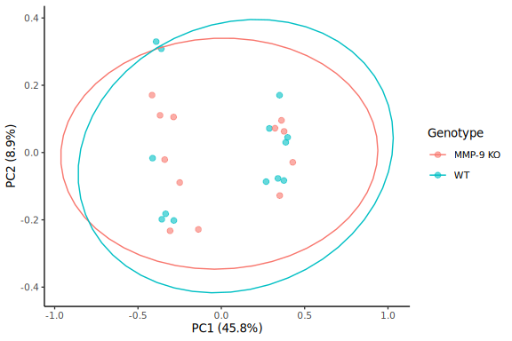

``` r
plist[[2]]
```

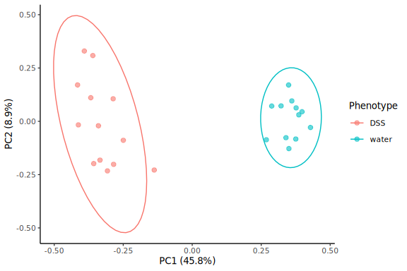

This function helps plot PCA score plots. It returns a list of the
original data, the PCA result and the ggplot. All dataframes are
returned in such a way that that ggplot produced can be modified with
additional geom layers.

Usage:

``` r
# get example data
data(asv_example)

# rownames have to be features
asv_counts <- data.frame(asv_example[2:ncol(asv_example)], row.names=asv_example$sequence)

asv_transformed <- clr(count_dataframe = asv_counts, return_as_dataframe = TRUE)
#> conditions vector supplied
#> multicore environment is is OK -- using the BiocParallel package
#> computing center with all features

# generate some random metadata for the 295 samples - 5 time points with each individual
# having a data point at each time point
metadata <- data.frame(Timepoint = c(rep("Time 1", 59),
                                     rep("Time 2", 59),
                                     rep("Time 3", 59),
                                     rep("Time 4", 59),
                                     rep("Time 5", 59)),
                       Individual = as.character(c(rep(c(1:59), 5))),
                       row.names=colnames(asv_transformed),
                       stringsAsFactors = FALSE)
metadata$ID <- rownames(metadata)

pca_result <- prcomp(t(asv_transformed), scale = TRUE)
plot_data <- plot_pca(pca_result, metadata, colourby='Timepoint')

plot_data$p
```

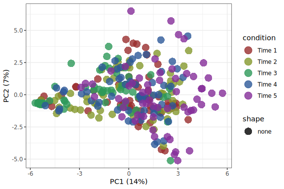

``` r
# modify default plot
add_meta <- merge(plot_data$pdata, metadata, by = 'row.names' )
col_val <- get_palette(5, "Set3")
p <- plot_data$p +
  scale_colour_manual(values = col_val) + # pick own colours
  scale_shape_manual(values=21, guide = FALSE) + # change shape and remove from legend
  geom_text(data = add_meta, aes(x = PC1, y = PC2, label = ID)) # add text label
#> Scale for colour is already present.
#> Adding another scale for colour, which will replace the existing scale.
p
#> Warning: The `guide` argument in `scale_*()` cannot be `FALSE`. This was deprecated in ggplot2 3.3.4.
#> i Please use "none" instead.
#> i The deprecated feature was likely used in the OCMSutility package.
#>   Please report the issue to the authors.
#> This warning is displayed once every 8 hours.
#> Call `lifecycle::last_lifecycle_warnings()` to see where this warning was generated.
```

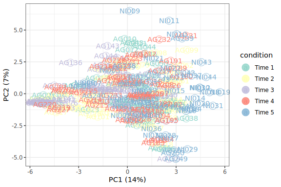

</details>
<details>
<summary>
featurebox
</summary>

## featurebox

This function takes a matrix of abudnances from RNA-seq or microbiome
data along with a metadata dataframe and produces a boxplot for a
feature(s) of interest. The main use for this function is to plot
abundance estimates grouping by variable of interest.

Usage:

``` r
# get example data
data(asv_example)

# rownames have to be features
asv_counts <- data.frame(asv_example[2:ncol(asv_example)], row.names=asv_example$sequence)

# for plotting purposes we would transform the data e.g. clr
asv_clr <- clr(asv_counts)
#> conditions vector supplied
#> multicore environment is is OK -- using the BiocParallel package
#> computing center with all features

# generate some random metadata for the 295 samples - 5 groups for example
metadata <- data.frame(Group = c(rep("Group 1", 59),
                                 rep("Group 2", 59),
                                 rep("Group 3", 59),
                                 rep("Group 4", 59),
                                 rep("Group 5", 59)),
                                 row.names=colnames(asv_clr))

# produce boxplot of random 4 features as an example grouping by Group variable
features <- sample(rownames(asv_clr), size=4)
featurebox(abundance_matrix=asv_clr, metadata=metadata, features=features, group_by="Group")
#> Using feature as id variables
#> Warning: Use of `mat.m$covariate` is discouraged.
#> i Use `covariate` instead.
#> Use of `mat.m$covariate` is discouraged.
#> i Use `covariate` instead.
```

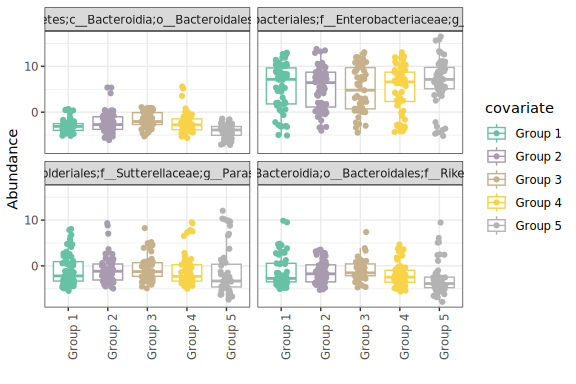

The default palettes used are “Set2”, “Set3” and “Set4”, and the result
will depend on the number of colours you need. You can change the
colours if you like by adding manual scale:

``` r
featurebox(abundance_matrix=asv_clr, metadata=metadata, features=features, group_by="Group") +
  scale_colour_manual(values=getPalette(n=5, palette="Set1"))
#> Using feature as id variables
#> Scale for colour is already present.
#> Adding another scale for colour, which will replace the existing scale.
#> Warning: Use of `mat.m$covariate` is discouraged.
#> i Use `covariate` instead.
#> Use of `mat.m$covariate` is discouraged.
#> i Use `covariate` instead.
```

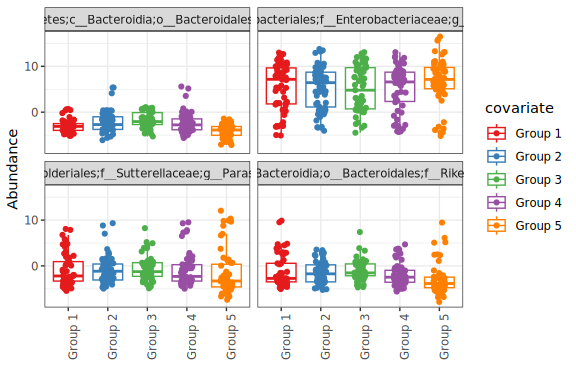

</details>
<details>
<summary>
pca by var
</summary>

## pca\_by\_var

This function overlays numeric metadata variables onto a PCA score plot,
which can be useful during exploratory analysis where you want to see
how different metadata variables map onto a PCA plot. This function
produces a named list of plots, where the first plot is the score/biplot
and subsequent plots are the same PCA plot but colour coded by a given
metadata variable. Metadata variables can be numeric, character, or
factors.

``` r
set.seed(1)
data(dss_example)

# samples in rows
ddata <- dss_example$merged_abundance_id[,2:26]
rownames(ddata) <- dss_example$merged_abundance_id[,1]
ddata <- as.data.frame(t(ddata))
mdata <- dss_example$metadata
mdata <- mdata[match(rownames(ddata), mdata$sampleID),]

# creating some dummy metadata variable
mdata$var1 <- rep(rnorm(5, 25, 3), each=5)
mdata$var2 <- rep(rnorm(5, 3, 0.5), 5)
mdata$var3 <- as.factor(rep(letters[1:5], each=5))
mdata <- mdata[,c('Phenotype','var1','var2','var3')]
p_list <- pca_by_var(ddata, mdata)

# biplot
p_list$main_pca
```


``` r
# pca with metadata variables overlayed
p_list$Phenotype
```

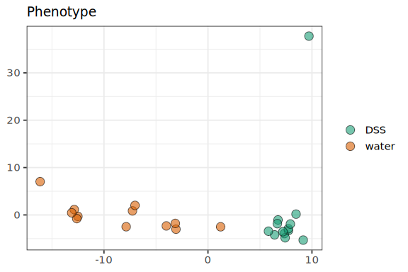

``` r
p_list$var1
```

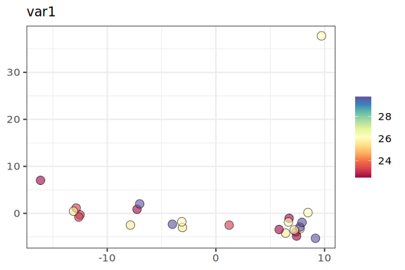

``` r
p_list$var2
```

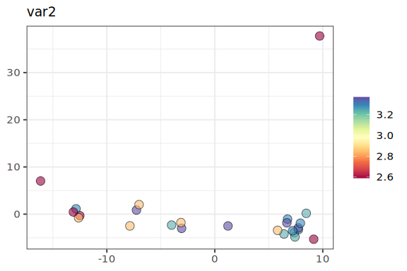

``` r
p_list$var3
```

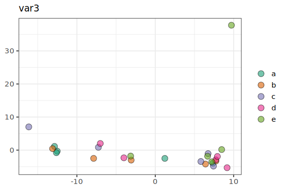

``` r
# can use cowplot::plot_grid to put all plots into one
cowplot::plot_grid(plotlist=list(p_list$Phenotype, p_list$var1, p_list$var2, p_list$var3))
```

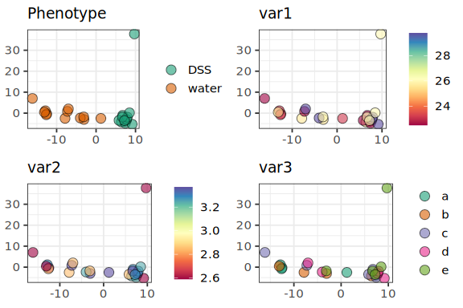

</details>
<details>
<summary>
pcoa by var
</summary>

## pcoa\_by\_var

This function overlays numeric metadata variables onto a PCoA score
plot, which can be useful during exploratory analysis where you want to
see how different metadata variables map onto a PCoA plot. This function
produces a named list of plots, where the first plot is the plain PCoA
and subsequent plots are the same PCoA plot but colour coded by a given
metadata variable. Metadata variables can be numeric, character, or
factors, but confidence interval ellipses will only be drawn for
categorical variables.

``` r
set.seed(1)
data(dss_example)
ddata <- dss_example$merged_abundance_id[,2:26]
rownames(ddata) <- dss_example$merged_abundance_id[,1]
ddata <- as.data.frame(t(relab(ddata)))

mdata <- dss_example$metadata
mdata <- mdata[match(rownames(ddata), mdata$sampleID),]

# creating some dummy metadata variable
mdata$var1 <- rnorm(25, 0.5, 3)
mdata$var2 <- rep(LETTERS[21:25], 5)
mdata$var3 <- as.factor(rep(letters[1:5], each=5))
mdata <- mdata[,c('Phenotype','var1','var2','var3')]
p_list <- pcoa_by_var(ddata, mdata, method='bray')

# pcoa
p_list$main_pcoa
```

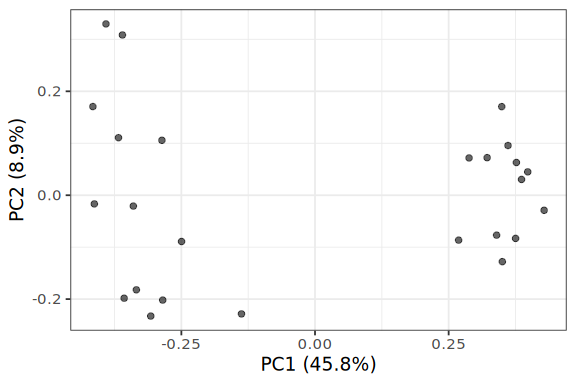

``` r
# pcoa with metadata variables overlayed. no ellipses draw when variables are numeric
p_list$Phenotype
```

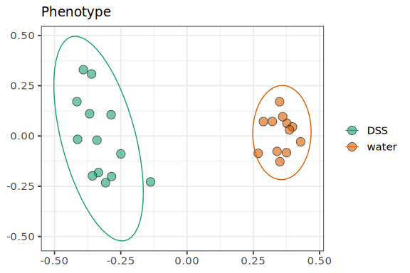

``` r
p_list$var1
```


``` r
p_list$var2
```

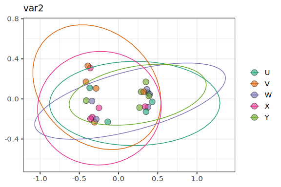

``` r
p_list$var3
```

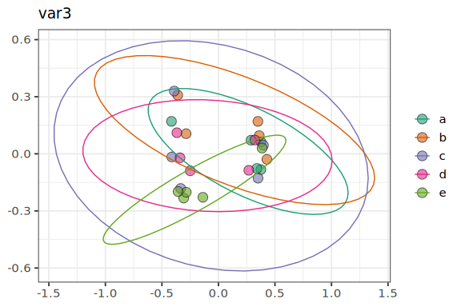

``` r
# can use cowplot::plot_grid to put all plots into one
cowplot::plot_grid(plotlist=list(p_list$Phenotype, p_list$var1, p_list$var2, p_list$var3))
```

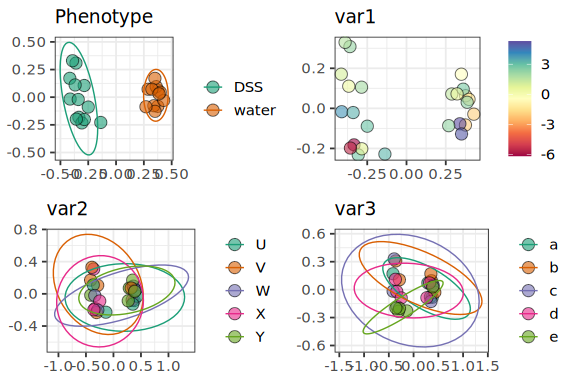

</details>
<details>
<summary>
annotated dendrogram
</summary>

## annotated\_dendrogram

This produces an annotated dendrogram showing heirarchical clustering
based on a distance matrix. This is helpful for visualizing how
different metadata variables map onto sample clustering. This is
equivalent to the annotation bars on a heatmap, but without the heatmap
values.

``` r
set.seed(1)
# get relative abundance data
data(dss_example)
ddata <- dss_example$merged_abundance_id[,2:26]
rownames(ddata) <- dss_example$merged_abundance_id[,1]
ddata <- t(OCMSutility::relab(ddata))
# distance matrix
mydist <- vegan::vegdist(ddata, method='bray')
# metdata variable
mdata <- dss_example$metadata
mdata <- mdata[,c('sampleID','Genotype','Phenotype')]
annotated_dendrogram(mydist, mdata, 'sampleID')
```

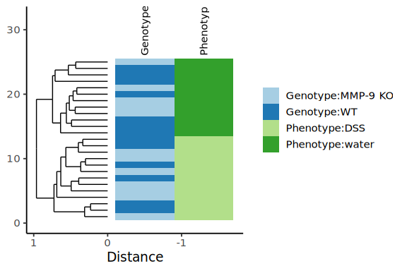

``` r
# custom colours
col_geno <- RColorBrewer::brewer.pal(9, "Paired")[1:2]
names(col_geno) <- c('Genotype:WT','Genotype:KO')
col_phen <- RColorBrewer::brewer.pal(9, "Paired")[3:4]
names(col_phen) <- c('Phenotype:water','Phenotype:DSS')
annotated_dendrogram(mydist, mdata, 'sampleID', pal=c(col_geno, col_phen))
```

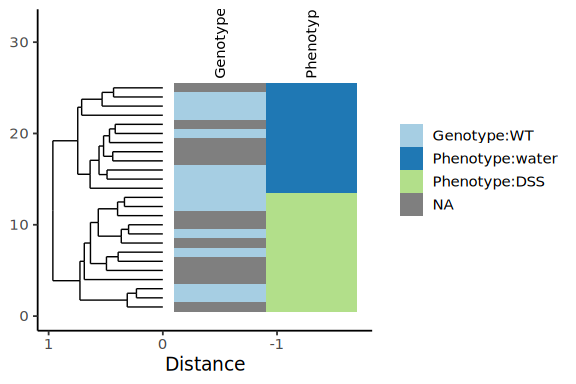
</details>
<details>
<summary>
plotSunburst
</summary>

## plotSunburst

This function has been moved to be an internal function, and the
`sunburstR` has been removed as a dependency (is now a suggested
package). This change has come about due to lack of use and an effort to
reduce the dependency overhead of the package. The funciton is still
accessible with `OCMSutility:::plotSunburst`

Creates interactive sunburst plot based on taxonomy. The sunburst plot
can show areas based on relative abundance or based on the number of
taxa at a given taxonomic level.

You specify a palette for each Phylum, where values are the colour
palette to use and name is the corresponding phylum
(e.g.`c('Bacteroidetes' = 'Oranges', 'Firmicutes' = 'Greens')`).
Palettes should be from
[rColorBrewer](https://www.r-graph-gallery.com/38-rcolorbrewers-palettes.html).
If the number of palettes specified doesn’t include all phyla in the tax
table, only the specified ones will be coloured and the rest will be in
grey. If palettes is set to NULL, the default colours selected by
`sunbrustR` will be used.

Additionally the `highlight` parameter can be used to highlight a
specific taxon at any taxonomic level and the ones that are not
specified will be coloured as grey.
e.g. `list("Family"=c("Enterococcaceae","Ruminacoccaceae")`. This is
applied after palettes is used to colour by phylum if palettes argument
is specified so you can use the `palettes` argument to choose your
colour and all taxa not specified by `hightlight` are set to grey.

Note: NAs in the taxonomy table cause colouring to be assigned in
unexpected order so it is best to use `reannotate_tax` to apply a
taxonomy roll-down and remove all NAs.
[sunburstR](https://github.com/timelyportfolio/sunburstR) uses hyphens
(`-`) to distinguish taxonomic levels so any hyphens in the taxonomy
name will be interpreted as two separate levels. Therefore, all hyphens
are silently and automatically removed from taxonomy names

``` r
data("dss_example")
# set count feature ids as rownames
count_df <- dss_example$merged_abundance_id %>%
  column_to_rownames('featureID')

# clean up some sample names
colnames(count_df) <- paste0('id', colnames(count_df))
tax_df <- dss_example$merged_taxonomy

# aggregate counts
agg_gen <- aggregate_count(count_df[tax_df$featureID,], tax_df, "Genus")
count_genus <- agg_gen$count_df

# reannotate taxonomy
tax_genus <- reannotate_tax(agg_gen$tax_df)

relab <- relab(count_genus)

# color specific phyla
# plotSunburst(relab = NULL, tax = tax_genus,  
#              palettes = c("Proteobacteria" = "Oranges",
#                           "Bacteroidetes" = "Greens"))
# color specific phyla taking into account of relative abundance
# plotSunburst(relab = relab, tax = tax_genus,  
#              palettes = c("Proteobacteria" = "Oranges", "Bacteroidetes" = "Greens"))

# highlight specific genera
# plotSunburst(relab = relab, tax = tax_genus, 
#              palettes = c("Bacteroidetes" = "Greens",'Firmicutes'='Blues'), 
#              highlight = list("Genus" = c("Bacteroides",'Clostridium XlVa')))
```

</details>

# Analysis

These functions perform simple analyses.

<details>
<summary>
true pos rate
</summary>

## true\_pos\_rate

Calculate rate of true positives in positive control standards. Used in
OCMS\_zymobioimcs report.

Usage:

``` r
# this would be better exemplified with actual std data rather than the example samples
data("dss_example")
data(zymobiomics)

# set count feature ids as rownames
count_df <- dss_example$merged_abundance_id %>%
  column_to_rownames('featureID')

# clean up some sample names
colnames(count_df) <- paste0('id', colnames(count_df))
tax_df <- dss_example$merged_taxonomy

# aggregate counts
agg_gen <- aggregate_count(count_df[tax_df$featureID,], tax_df, "Genus")
genus_relab <- relab(agg_gen$count_df)

true_pos_result <- true_pos_rate(relab=genus_relab,
                                    annotations=zymobiomics$anno_ncbi_16s,
                                    level='genus', cutoff=0.01)

# plot true pos rate
p <- ggplot(true_pos_result,
            aes(x=rank, y=true.pos.rate, colour=label, group=sample)) +
  geom_point() +
  theme_bw() +
  ylab("TP / (TP + FP)") +
  scale_colour_manual(values=c("grey", "purple")) +
  facet_wrap(~sample, scale="free")

p
```

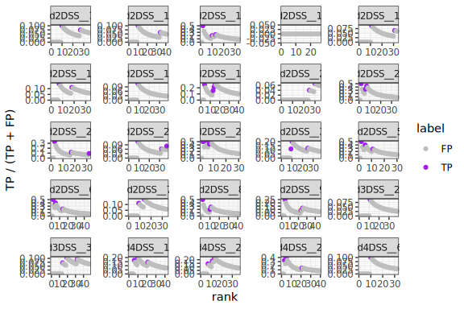

</details>
<details>
<summary>
nsamples by var
</summary>

## nsample\_by\_var

This function counts the number of samples for each individual for a
given metadata variable. This is useful in time course data when you
want to check how complete the metadata variables are. This is
complementary to `metadata_sparsity`, which tells you which gives
information on missing values, while `nsample_by_var` gives information
on the available metadata.

Usage:

Takes in a dataframe where samples are in rows and metadata variables
are in columns. Providing the identifier column and the metadata
variables to tally, the function returns a tally of the number of non-NA
samples for each identifier for a given metadata variable.

In the example below, we have 25 patients, each with 4 time point
samples, and three metadata variables.

``` r
df <- data.frame(sample_id = paste0("sample", 1:100),
                patient_id = rep(LETTERS[1:25], 4),
                var1 = sample(c(rnorm(30, 10, 0.5), rnorm(40, 25, 2),
                                rep(NA, 30)), 100),
                var2 = sample(c(rnorm(65, 0.5, 0.01),
                                rep(0, 20),
rep(NA, 15)), 100),
                var3 = sample(c(letters[1:5], NA), 100, replace=TRUE))

nsample_by_var(df, 'patient_id', c('var1','var2','var3'))
#>    patient_id var1 var2 var3
#> 1           A    3    3    4
#> 2           B    3    4    3
#> 3           C    2    4    3
#> 4           D    2    4    2
#> 5           E    3    4    3
#> 6           F    2    3    4
#> 7           G    3    4    4
#> 8           H    1    3    3
#> 9           I    1    2    3
#> 10          J    4    4    3
#> 11          K    3    4    4
#> 12          L    4    3    2
#> 13          M    3    2    4
#> 14          N    1    4    3
#> 15          O    3    4    4
#> 16          P    3    3    3
#> 17          Q    3    3    3
#> 18          R    4    4    4
#> 19          S    4    3    4
#> 20          T    4    3    1
#> 21          U    4    4    3
#> 22          V    3    2    3
#> 23          W    2    3    4
#> 24          X    2    4    4
#> 25          Y    3    4    4
```

</details>
<details>
<summary>
compare cor ci
</summary>

## compare\_cor\_ci

Performs pairwise correlations of features with adjusted p-values.
Correlations and confidence intervals calculated for each sample group.

Usage:

``` r
# load example data
data(dss_example)

# subset features, features in columns
feat_mat <- dss_example$merged_abundance_id[1:6,2:26]
rownames(feat_mat) <- dss_example$merged_abundance_id[1:6,1]
feat_mat <- t(feat_mat)

# metadata in same order
met_df <- dss_example$metadata
met_df <- met_df[match(rownames(feat_mat), met_df$sampleID),]
compare_cor_ci(feat_mat, met_df$Phenotype)
#> Warning in cor(x, use = use, method = method): the standard deviation is zero
#>       x    y group  n           r          p     p.adj    lower_ci  upper_ci
#> 1  ASV1 ASV2   DSS 13          NA         NA        NA          NA        NA
#> 2  ASV1 ASV3   DSS 13 -0.17292227 0.57211293 0.8796790 -0.66093523 0.4178774
#> 3  ASV1 ASV4   DSS 13 -0.34430158 0.94229442 0.7479965 -0.75252840 0.2550722
#> 4  ASV1 ASV5   DSS 13 -0.02232353         NA 0.9422944 -0.56634285 0.5352453
#> 5  ASV1 ASV6   DSS 13          NA 0.58645268        NA          NA        NA
#> 6  ASV2 ASV3   DSS 13          NA 0.24933216        NA          NA        NA
#> 7  ASV2 ASV4   DSS 13          NA         NA        NA          NA        NA
#> 8  ASV2 ASV5   DSS 13          NA         NA        NA          NA        NA
#> 9  ASV2 ASV6   DSS 13          NA         NA        NA          NA        NA
#> 10 ASV3 ASV4   DSS 13  0.49936118         NA 0.4939076 -0.07121951 0.8237103
#> 11 ASV3 ASV5   DSS 13  0.16659937         NA 0.8796790 -0.42323641 0.6572529
#> 12 ASV3 ASV6   DSS 13          NA 0.81852228        NA          NA        NA
#> 13 ASV4 ASV5   DSS 13 -0.07067946 0.08231793 0.9422944 -0.59836252 0.4997685
#> 14 ASV4 ASV6   DSS 13          NA         NA        NA          NA        NA
#> 15 ASV5 ASV6   DSS 13          NA         NA        NA          NA        NA
#> 16 ASV1 ASV2 water 12  0.18564204 0.56349873 0.8193311 -0.43455744 0.6864130
#> 17 ASV1 ASV3 water 12  0.08650613 0.78922369 0.8455968 -0.51285678 0.6291719
#> 18 ASV1 ASV4 water 12  0.13702012 0.03866202 0.8193311 -0.47416823 0.6590932
#> 19 ASV1 ASV5 water 12  0.60121866 0.69985094 0.2899652  0.04170797 0.8736692
#> 20 ASV1 ASV6 water 12  0.12008510 0.14872901 0.8193311 -0.48740718 0.6492428
#> 21 ASV2 ASV3 water 12 -0.04731533 0.67110167 0.8839068 -0.60479416 0.5412845
#> 22 ASV2 ASV4 water 12 -0.12450292 0.71008691 0.8193311 -0.65182972 0.4839803
#> 23 ASV2 ASV5 water 12  0.25704233 0.41994958 0.8193311 -0.37168987 0.7241234
#> 24 ASV2 ASV6 water 12  0.12330163 0.01030401 0.8193311 -0.48491396 0.6511275
#> 25 ASV3 ASV4 water 12 -0.18837193 0.88390679 0.8193311 -0.68790611 0.4322600
#> 26 ASV3 ASV5 water 12  0.44347367 0.70262984 0.7436451 -0.17495605 0.8109741
#> 27 ASV3 ASV6 water 12  0.70591564 0.54824959 0.1545601  0.22191935 0.9108202
#> 28 ASV4 ASV5 water 12  0.19281163 0.55767227 0.8193311 -0.42850631 0.6903254
#> 29 ASV4 ASV6 water 12 -0.29445657 0.35286181 0.8193311 -0.74282830 0.3362712
#> 30 ASV5 ASV6 water 12  0.36129770 0.24854130 0.8193311 -0.26821893 0.7745888
```

</details>
<details>
<summary>
dissimilarity
</summary>

## dissimilarity

This function is bested used for repeated measures data. The purpose of
this function is to determine dissimilarity between samples using
Bray-Curtis dissimilarity. This is typically done if you want to compare
dissimilarity between groups or compare within-individual dissimilarity
with between-individual similarity where you have multiple samples per
individual. The function takes a relative abundance matrix and relevant
metadata as input and outputs a data frame with Bray-Curtis
dissimilarity measure that can be plotted. Below is an example where
this may be of use.

Usage:

``` r
# get example data
data(asv_example)

# rownames have to be features
asv_counts <- data.frame(asv_example[2:ncol(asv_example)], row.names=asv_example$sequence)

asv_relab <- relab(asv_counts)

# generate some random metadata for the 295 samples - 5 time points with each individual
# having a data point at each time point
metadata <- data.frame(Timepoint = c(rep("Time 1", 59),
                                     rep("Time 2", 59),
                                     rep("Time 3", 59),
                                     rep("Time 4", 59),
                                     rep("Time 5", 59)),
                       Individual = as.character(c(rep(c(1:59), 5))),
                       row.names=colnames(asv_relab),
                       stringsAsFactors = FALSE)

# remove samples with NA
asv_relab <- asv_relab[,!(is.na(colSums(asv_relab)))]

# make sure they are the same
metadata <- metadata[colnames(asv_relab),]

# ask the question - Are individuals more similar to each other than samples are within timepoints?

# within-individual dissimilarity
within_diss <- dissimilarity(asv_relab, metadata=metadata, individual_variable = "Individual", method="within")

knitr::kable(head(within_diss))
```

| dissimilarity | method            |
|--------------:|:------------------|
|     0.7080197 | Within-individual |
|     0.8067290 | Within-individual |
|     0.8098117 | Within-individual |
|     0.8455110 | Within-individual |
|     0.5200789 | Within-individual |
|     0.9769913 | Within-individual |

``` r
# between-individual dissimilarity at timpoint 1
metadata_t1 <- metadata[metadata$Timepoint == "Time 1",]
asv_relab_t1 <- asv_relab[,rownames(metadata_t1)]
between_diss <- dissimilarity(asv_relab_t1, metadata=metadata_t1, method="between")
#> using method=between, make sure there is only one sample per individual

knitr::kable(head(between_diss))
```

| dissimilarity | method             |
|--------------:|:-------------------|
|     0.8130555 | Between-individual |
|     0.8108123 | Between-individual |
|     0.8153680 | Between-individual |
|     0.8027017 | Between-individual |
|     0.9662146 | Between-individual |
|     0.8061727 | Between-individual |

``` r
# we can then combine and plot them
diss <- bind_rows(within_diss, between_diss)
ggplot(diss, aes(x=method, y=dissimilarity)) +
  geom_violin() +
  xlab("Dissimilarity type") +
  ylab("Bray-Curtis dissimilarity") +
  theme_bw()
```

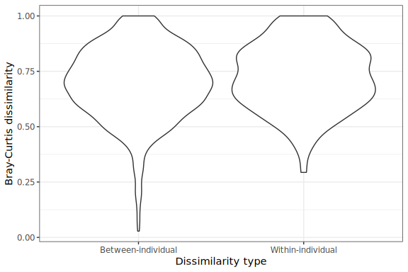

</details>
<details>
<summary>
bc dissimilarity
</summary>

## bcdissimilarity

Useful for measuring sample dissimilarity using Bray-Curtis distances.
You can supply a metadata variable to assign comparisons as either
within-group or between group. This is useful when assessing the within
group dissimilarity (either as a whole, or for each individual group)
compared to between group dissimilarity. This function differs from
`dissimilarity` in that this can be applied to non-repeated measures
data.

If within/between group assignments are not necessary, set `var=NULL`

This function returns a list:

-   `bc_df` long dataframe of dissimilarity scores respective metadata
    of the comparison
-   `bc_dist` symmetrical matrix of Bray-Curtis distances

``` r
data(dss_example)
count_table <- dss_example$merged_abundance_id %>% column_to_rownames('featureID')
relab_table <- relab(count_table)
met_table <- dss_example$metadata

# bray curtis for one metadata variable
bc_result <- bcdissimilarity(relab_table, met_table, 'sampleID','Phenotype')
pdata <- bc_result$bc_df
p_phen <- ggplot(pdata, aes(x=value, y=dist)) +
  geom_violin() +
  theme_bw(14) +
  ylab('Bray-Curtis Dissimilarity') +
  xlab('Phenotype')

p_phen
```

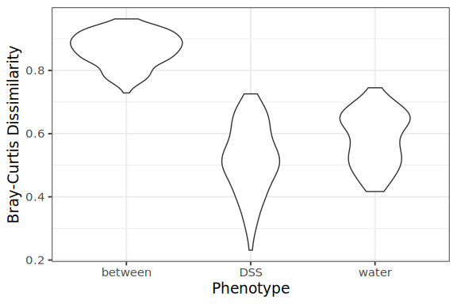

``` r
# for multiple metadata variables
bc_data <- c()
for(var in c('Phenotype','Genotype')) {
   bc_result <- bcdissimilarity(relab_table, met_table, 'sampleID', var)
   bc_data <- rbind(bc_data, bc_result$bc_df)
}
p_bc <- ggplot(bc_data, aes(x=comparison, y=dist)) +
  geom_violin() +
  theme_bw(14) +
  facet_wrap(~met_var) +
  ylab('Bray-Curtis Dissimilarity') +
  theme(axis.title.x=element_blank())

p_bc
```

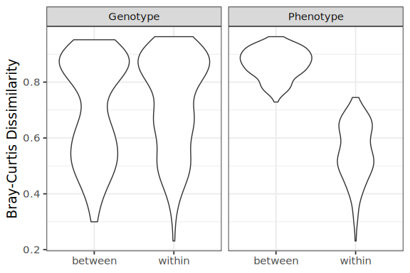

</details>
<details>
<summary>
rarefaction
</summary>

## rarefaction

Useful for calculating and plotting rarefaction curve to check if read
depth captures as much diversity as possible.

``` r
# get example data
data(asv_example)

# rownames have to be features
asv_counts <- data.frame(asv_example[2:ncol(asv_example)], row.names=asv_example$sequence)

rarefaction <- rarefaction(asv_counts)
#> Warning: executing %dopar% sequentially: no parallel backend registered
#> Warning in max(x, na.rm = T): no non-missing arguments to max; returning -Inf
#> Warning in max(x, na.rm = T): no non-missing arguments to max; returning -Inf
#> Warning in max(x, na.rm = T): no non-missing arguments to max; returning -Inf
#> Warning in max(x, na.rm = T): no non-missing arguments to max; returning -Inf
#> Warning in max(x, na.rm = T): no non-missing arguments to max; returning -Inf
#> Warning in max(x, na.rm = T): no non-missing arguments to max; returning -Inf
#> Warning in max(x, na.rm = T): no non-missing arguments to max; returning -Inf
#> Warning in max(x, na.rm = T): no non-missing arguments to max; returning -Inf
#> Warning in max(x, na.rm = T): no non-missing arguments to max; returning -Inf
#> Warning in max(x, na.rm = T): no non-missing arguments to max; returning -Inf
#> Warning in max(x, na.rm = T): no non-missing arguments to max; returning -Inf
#> Warning in max(x, na.rm = T): no non-missing arguments to max; returning -Inf
#> Warning in max(x, na.rm = T): no non-missing arguments to max; returning -Inf
#> Warning in max(x, na.rm = T): no non-missing arguments to max; returning -Inf

# default plot
p <- rarefaction$rare_p
p
#> Warning: ggrepel: 258 unlabeled data points (too many overlaps). Consider
#> increasing max.overlaps
```

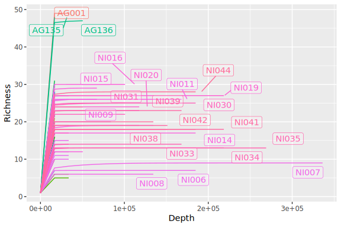

``` r
# modify default plot -- remove geom_label_repel layer
p$layers[[2]] <- NULL
p
```

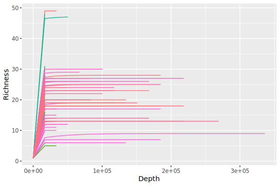

</details>
<details>
<summary>
metadata sparsity
</summary>

## metadata\_sparsity

This function checks your metadata for the number of missing values in
each sample. This function can be used to check how sparse the metadata
is. In human studies, it is easy to have sparse metadata which
inadvertently gives subsets of samples simply based on the amount of
available information. This function tallies the number of NA in each
sample and returns subsets of samples based on the number of missing
values they have.

Usage:

Takes in a dataframe where samples are in rows and metadata variables
are in columns. The function returns a list where the first item in the
list `na_tally` shows the number of samples with a given number of
missing values.

``` r
set.seed(1)
# setting up example metadata dataframe
 metadata_example <- data.frame(
   sampleID = LETTERS[1:10],
   group = c(rep(1:2, each = 3), rep(3, 4)),
   age = c(rnorm(6, 30, 5), rep(NA, 4)),
   sex = c(rep('F', 3), rep(NA, 4), rep('M', 3)),
   ethnicity = sample(c(NA,1,2,3), 10, replace = TRUE),
   medication = sample(c(NA,1,2), 10, replace=TRUE))

met_sparse <- metadata_sparsity(metadata_example)

summary(met_sparse)
#>          Length Class      Mode
#> na_tally 2      data.frame list
#>          6      data.frame list
#>          6      data.frame list
#>          6      data.frame list
met_sparse$na_tally
#>   n_na Freq
#> 1    1    3
#> 2    2    6
#> 3    3    1
met_sparse[[3]]
#>   sampleID group      age  sex ethnicity medication
#> 1        A     1 26.86773    F        NA         NA
#> 2        B     1 30.91822    F        NA         NA
#> 3        C     1 25.82186    F        NA         NA
#> 4        D     2 37.97640 <NA>         1         NA
#> 6        F     2 25.89766 <NA>         1         NA
#> 9        I     3       NA    M        NA          1
met_sparse[[4]]
#>   sampleID group age  sex ethnicity medication
#> 7        G     3  NA <NA>         1         NA
```

</details>

# Utility

These functions are helful for data manipulation in general.

<details>
<summary>
get shortnames
</summary>

## get\_shortnames

For visualisation purposes i.e. to not have the whole taxonomic label
for a taxon you can just get the lowest rank

Usage:

``` r
longname <- dss_example$merged_taxonomy$Taxon[4]
cat(longname)
#> k__Bacteria;p__Firmicutes;c__Clostridia;o__Clostridiales;f__Ruminococcaceae;g__Faecalibacterium;s__Faecalibacterium_prausnitzii(AJ413954)

get_shortnames(longname)
#> [1] "Faecalibacterium_prausnitzii(AJ413954)"
```

</details>
<details>
<summary>
get palette
</summary>

## get\_palette

This is a convenience function for getting a set of colours for plotting
purposes. Setting preview=TRUE will show you the colours. The colours
can be changed by adding a palette(s) to the palette argument.

Usage:

``` r
getPalette(n=10, palette="Set3", preview=TRUE)
```


    #>  [1] "#8DD3C7" "#FFFFB3" "#BEBADA" "#FB8072" "#80B1D3" "#FDB462" "#B3DE69"
    #>  [8] "#FCCDE5" "#D9D9D9" "#BC80BD"

</details>
<details>
<summary>
convert platemap
</summary>

## convert\_platemap

This function converts excel plate map to long data frame with map
locations. It uses [readxl](https://readxl.tidyverse.org) to read in
excel file.

Usage: You supply the function with the excel file and specify the sheet
name (if applicable) and the cell range that contains your plate map.
`convert_platemap` then converts the platemap into a long data frame.
The `drop_empty` function allows your to drop unlabeled wells.

``` r
convert_platemap(plate_map = "my96wellplate.xlsx",
                              map_range = 'A1:H12') 
```

    #>    well_id               col            row             well_value       
    #>  Length:96          Min.   : 1.00   Length:96          Length:96         
    #>  Class :character   1st Qu.: 3.75   Class :character   Class :character  
    #>  Mode  :character   Median : 6.50   Mode  :character   Mode  :character  
    #>                     Mean   : 6.50                                        
    #>                     3rd Qu.: 9.25                                        
    #>                     Max.   :12.00

| well\_id | col | row | well\_value   |
|:---------|----:|:----|:--------------|
| A1       |   1 | A   | sample\_name1 |
| A2       |   2 | A   | sample\_name2 |
| A3       |   3 | A   | sample\_name3 |
| A4       |   4 | A   | sample\_name4 |
| A5       |   5 | A   | sample\_name5 |
| A6       |   6 | A   | sample\_name6 |

``` r
# example output of convert_platemap
myplate <- as.data.frame(matrix(rnorm(96, mean=0.1, sd=0.05), 
                                nrow=8, ncol=12, 
                                dimnames=list(LETTERS[1:8], 1:12)))
plate_df <- convert_platemap(from_file = FALSE, plate_map = myplate) 
print(summary(plate_df))
#>      row                col              well_value          well_id         
#>  Length:96          Length:96          Min.   :0.0005324   Length:96         
#>  Class :character   Class :character   1st Qu.:0.0752879   Class :character  
#>  Mode  :character   Mode  :character   Median :0.1037227   Mode  :character  
#>                                        Mean   :0.1061450                     
#>                                        3rd Qu.:0.1348888                     
#>                                        Max.   :0.2200809
kable(head(plate_df))
```

| row | col | well\_value | well\_id |
|:----|:----|------------:|:---------|
| A   | 1   |   0.0991905 | A1       |
| B   | 1   |   0.1471918 | B1       |
| C   | 1   |   0.1410611 | C1       |
| D   | 1   |   0.1296951 | D1       |
| E   | 1   |   0.1459489 | E1       |
| F   | 1   |   0.1391068 | F1       |

</details>
<details>
<summary>
sym mat2df
</summary>

## sym\_mat2df

Converts symmetrical matrix to long dataframe, with columns `x`, `y`,
`value`. Helpful for correlation or distance matrices

Usage:

``` r
# load example data
data(dss_example)

# subset features, features in columns
feat_mat <- dss_example$merged_abundance_id[1:6,2:26]
rownames(feat_mat) <- dss_example$merged_abundance_id[1:6,1]
feat_mat <- t(feat_mat)

# correlation matrix
corr_result <- cor(feat_mat)
sym_mat2df(corr_result)
#>      X1   X2        value
#> 1  ASV1 ASV2  0.328933077
#> 2  ASV1 ASV3  0.458898743
#> 3  ASV1 ASV4  0.273324036
#> 4  ASV1 ASV5  0.770830067
#> 5  ASV1 ASV6  0.577547045
#> 6  ASV2 ASV3  0.162107933
#> 7  ASV2 ASV4 -0.002684052
#> 8  ASV2 ASV5  0.384139309
#> 9  ASV2 ASV6  0.318054017
#> 10 ASV3 ASV4  0.102121821
#> 11 ASV3 ASV5  0.700666100
#> 12 ASV3 ASV6  0.834738679
#> 13 ASV4 ASV5  0.315981925
#> 14 ASV4 ASV6  0.121482740
#> 15 ASV5 ASV6  0.749430510
```

</details>
<details>
<summary>
adjust mat pval
</summary>

## adjust\_mat\_pval

Adjust matrix of p-values for multiple correction and returns the
adjusted p-values as symmertrical matrix or as long dataframe. Helpful
for correlation matrices.

Usage:

``` r
# load example data
data(dss_example)

# subset features, features in columns
feat_mat <- dss_example$merged_abundance_id[1:6,2:26]
rownames(feat_mat) <- dss_example$merged_abundance_id[1:6,1]
feat_mat <- t(feat_mat)

# correlation matrix
corr_result <- psych::corr.test(feat_mat)
adjust_mat_pval(corr_result$p)
#>              ASV1 ASV2         ASV3 ASV4         ASV5         ASV6
#> ASV1 1.0000000000    1 5.257982e-01    1 0.0006842817 8.253906e-02
#> ASV2 1.0000000000    1 1.000000e+00    1 1.0000000000 1.000000e+00
#> ASV3 0.5257981878    1 1.000000e+00    1 0.0043193475 4.783898e-05
#> ASV4 1.0000000000    1 1.000000e+00    1 1.0000000000 1.000000e+00
#> ASV5 0.0006842817    1 4.319347e-03    1 1.0000000000 1.053959e-03
#> ASV6 0.0825390647    1 4.783898e-05    1 0.0010539587 1.000000e+00
adjust_mat_pval(corr_result$p, out_type='dataframe')
#>      X1   X2      padjust
#> 1  ASV1 ASV2 1.000000e+00
#> 2  ASV1 ASV3 5.257982e-01
#> 3  ASV1 ASV4 1.000000e+00
#> 4  ASV1 ASV5 6.842817e-04
#> 5  ASV1 ASV6 8.253906e-02
#> 6  ASV2 ASV3 1.000000e+00
#> 7  ASV2 ASV4 1.000000e+00
#> 8  ASV2 ASV5 1.000000e+00
#> 9  ASV2 ASV6 1.000000e+00
#> 10 ASV3 ASV4 1.000000e+00
#> 11 ASV3 ASV5 4.319347e-03
#> 12 ASV3 ASV6 4.783898e-05
#> 13 ASV4 ASV5 1.000000e+00
#> 14 ASV4 ASV6 1.000000e+00
#> 15 ASV5 ASV6 1.053959e-03
```

</details>
<details>
<summary>
remove geom
</summary>

## remove\_geom

Remove a specific geom layer from a ggplot.

Usage:

``` r
d <- data.frame(x = runif(10),y = runif(10),label = sprintf("label%s", 1:10))
                
# ggplot with geom_text_repel from ggrepel
p1 <- ggplot(d, aes(x, y, label = label)) + 
  geom_point() + 
  geom_text()

# Remove the labels added by ggrepel.
p2 <- remove_geom(p1, "GeomText")

p1
```

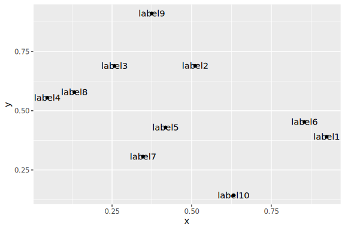

``` r
p2
```

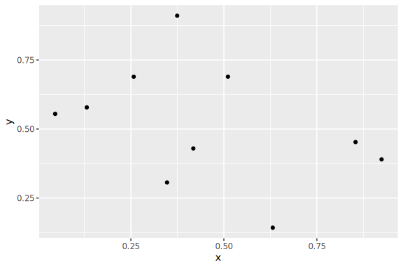
